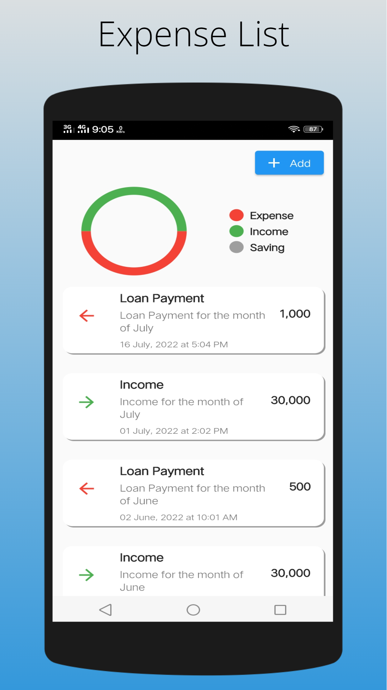
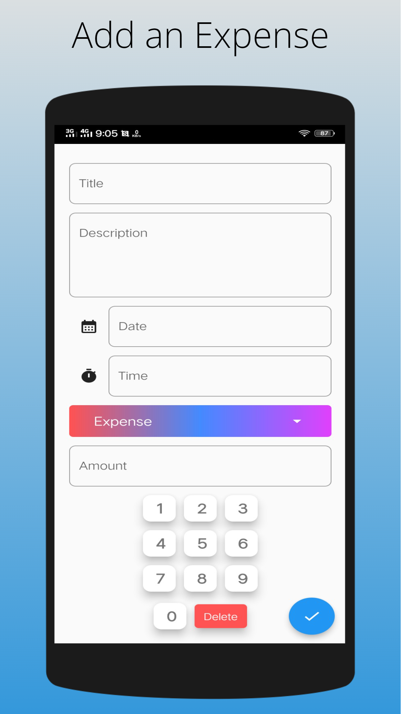

# Expense Tracker

A Expense Tracker App. What Does an Expense Tracker App Do? An expense tracker app allows you to monitor and categorize your expenses across different bank and investment accounts and credit cards. Now Take your expense tracker with you wherever you go.

# Screenshots

